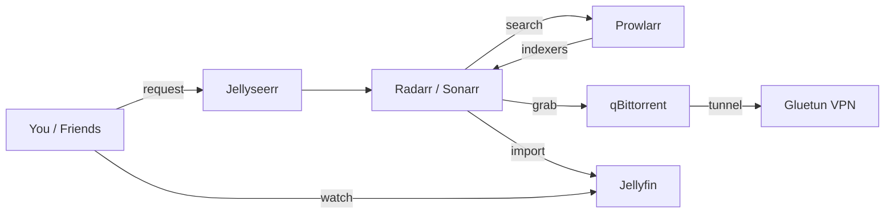

# Home Media Server

A self-hosted media server stack that lets you request, download, and stream movies and TV shows from your own hardware. Built with Docker.

## What's Included

| Service | What It Does | Port |
|---|---|---|
| **Jellyfin** | Stream your media (like a personal Netflix) | `8096` |
| **Jellyseerr** | Request movies/shows (your friends can use this too) | `5055` |
| **Radarr** | Automatically finds and downloads movies | `7878` |
| **Sonarr** | Automatically finds and downloads TV shows | `8989` |
| **Prowlarr** | Manages torrent indexers for Radarr/Sonarr | `9696` |
| **qBittorrent** | Downloads torrents | `8080` |
| **Gluetun** | VPN tunnel (all torrent traffic goes through this) | - |
| **FlareSolverr** | Bypasses Cloudflare protection on indexer sites | - |
| **Unpackerr** | Extracts compressed downloads automatically | - |
| **Recommendarr** | AI-powered media recommendations | `3001` |
| **Glance** | Dashboard to monitor everything | `3000` |
| **Watchtower** | Monitors for container image updates | - |

### How It All Connects



## Prerequisites

You'll need the following before starting:

- **A Linux machine** (Ubuntu, Debian, Arch, etc.) that will stay on 24/7
- **Docker** and **Docker Compose** installed
- **A ProtonVPN account** (paid plan with WireGuard support)
- **Storage space** for your media (an external/internal hard drive works)
- **[Optional] An NVIDIA GPU** for hardware-accelerated video transcoding
- **[Optional] A [Tailscale](https://tailscale.com) account** to access your server remotely from anywhere (phone, laptop, etc.) without exposing it to the internet
- **[Optional] A domain + cheap VPS** for public access (e.g., for family members who shouldn't have to install Tailscale). See [Public Access](#public-access-optional) below.

### Getting Your ProtonVPN WireGuard Key

1. Log in to [ProtonVPN](https://account.protonvpn.com)
2. Go to **Downloads** > **WireGuard configuration**
3. Create a new WireGuard certificate/key
4. In the generated config, the `PrivateKey` line is what you need

## Setup

### 1. Clone this repo

```bash
git clone https://github.com/SyedAbuTalib/server.git
cd server
```

### 2. Create your storage directories

Pick where you want your media stored. The default is `/mnt/storage/data`. If you want it somewhere else (like `~/media` or an external drive), just replace `/mnt/storage/data` everywhere in `docker-compose.yml`.

```bash
mkdir -p /mnt/storage/data/torrents
mkdir -p /mnt/storage/data/media/movies
mkdir -p /mnt/storage/data/media/tv
```

### 3. Configure your environment

```bash
cp .env.example .env
```

Now edit `.env` with your actual values:

```bash
nvim .env
```

Fill in:
- `WIREGUARD_PRIVATE_KEY` - from the ProtonVPN step above
- `WATCHTOWER_TOKEN` and `WATCHTOWER_WEBHOOKID` - from a Discord webhook URL (format: `discord://TOKEN@WEBHOOKID`). Optional; remove the watchtower notification lines from `docker-compose.yml` if you don't want Discord notifications.
- `SONARR_API_KEY` and `RADARR_API_KEY` - you'll get these AFTER first startup (see step 6)
- `SERVER_HOSTNAME` - your machine's hostname (run `hostname` to find out)
- `SERVER_URL` - `http://YOUR_HOSTNAME` (e.g., `http://myserver`)
- The Tailscale and weather fields are optional (only used by the Glance dashboard)

### 4. [If you DON'T have an NVIDIA GPU] Remove the GPU section

If your machine doesn't have an NVIDIA GPU, you **must** edit `docker-compose.yml` and remove these lines from the `jellyfin` service (otherwise Docker will fail to start):

```yaml
    deploy:
      resources:
        reservations:
          devices:
            - driver: nvidia
              count: 1
              capabilities: [gpu]
```

If you DO have an NVIDIA GPU, make sure you have the [NVIDIA Container Toolkit](https://docs.nvidia.com/datacenter/cloud-native/container-toolkit/latest/install-guide.html) installed.

### 5. Start everything

```bash
docker compose up -d
```

Wait about 30 seconds for everything to initialize. Check that all containers are running:

```bash
docker ps
```

You should see all 12 containers with status `Up`.

### 6. Configure the services

This is the most involved part. You need to connect the services to each other through their web UIs. Open each one in your browser using `http://YOUR_SERVER_IP:PORT`.

#### A. Prowlarr (`:9696`) - Set up indexers

1. Go to `http://YOUR_IP:9696`
2. Create a username and password when prompted
3. Go to **Indexers** > **Add Indexer**
4. Add some torrent indexers (browse the list and pick what works for you)
5. Go to **Settings** > **Apps** > **Add Application**
6. Add **Radarr**: host = `radarr`, port = `7878`, API key (get it from Radarr below)
7. Add **Sonarr**: host = `sonarr`, port = `8989`, API key (get it from Sonarr below)

#### B. Radarr (`:7878`) - Movies

1. Go to `http://YOUR_IP:7878`
2. Create a username and password when prompted
3. Go to **Settings** > **General** > copy the **API Key** (you'll need this)
4. Go to **Settings** > **Download Clients** > **Add** > **qBittorrent**
   - Host: `gluetun`
   - Port: `8080`
   - Username: `admin`
   - Password: check qBittorrent's logs for the temp password: `docker logs qbittorrent 2>&1 | grep password`
5. Go to **Settings** > **Media Management**
   - Click **Add Root Folder** and set it to `/data/media/movies`

#### C. Sonarr (`:8989`) - TV Shows

Same steps as Radarr, but:
- Root folder: `/data/media/tv`
- Copy its API key too

#### D. Update your `.env` with the API keys

Now that Radarr and Sonarr are running, paste their API keys into your `.env`:

```
SONARR_API_KEY=your_key_here
RADARR_API_KEY=your_key_here
```

Then restart unpackerr to pick them up:

```bash
docker compose up -d unpackerr
```

#### E. qBittorrent (`:8080`) - Download client

1. Go to `http://YOUR_IP:8080`
2. Get the temporary password from logs: `docker logs qbittorrent 2>&1 | grep password`
3. Log in and go to **Settings** (gear icon)
4. **Change the default password**
5. Under **Downloads**, set the default save path to `/data/torrents`

#### F. Jellyfin (`:8096`) - Media server

1. Go to `http://YOUR_IP:8096`
2. Follow the setup wizard
3. Add media libraries:
   - **Movies**: `/data/media/movies`
   - **Shows**: `/data/media/tv`
4. Create user accounts for anyone who will be watching

#### G. Jellyseerr (`:5055`) - Request portal

1. Go to `http://YOUR_IP:5055`
2. Sign in with your Jellyfin account
3. Connect to Jellyfin:
   - Host: `http://jellyfin`
   - Port: `8096`
4. Add Radarr:
   - Host: `radarr`
   - Port: `7878`
   - API Key: your Radarr API key
   - Click **Test**, then set a quality profile and root folder
5. Add Sonarr:
   - Host: `sonarr`
   - Port: `8989`
   - API Key: your Sonarr API key
   - Click **Test**, then set a quality profile and root folder

### 7. Test it

1. Open Jellyseerr (`:5055`)
2. Search for a movie
3. Click **Request**
4. Watch it flow: Jellyseerr > Radarr > qBittorrent > Jellyfin
5. Once downloaded, it should appear in Jellyfin within a few minutes

## Public Access (Optional)

By default the stack is reachable only on your LAN (or via Tailscale). If you want non-technical users — say, family — to use Jellyfin and Jellyseerr by just typing a URL, the setup is:

```
Internet ──> your domain ──> small VPS (Caddy reverse proxy) ──> WireGuard tunnel ──> your home server
```

The VPS only terminates TLS and forwards bytes — your home machine still does all the decoding/transcoding. Your home IP is never exposed.

### Why not Tailscale Funnel or Cloudflare Tunnel?

- **Tailscale Funnel**: not designed for high-bandwidth video — would throttle multiple concurrent streams.
- **Cloudflare Tunnel**: free tier TOS discourages video streaming through their proxy.
- **VPS + WireGuard + Caddy**: no bandwidth caps beyond what you pay for, full control. A $5/mo Hetzner CPX11 with 20 TB/month included egress handles several concurrent 4K streams comfortably.

### What you need

- A domain (e.g. [Porkbun](https://porkbun.com), [Cloudflare Registrar](https://www.cloudflare.com/products/registrar/) — ~$10/yr)
- A small VPS (Hetzner CPX11 or any cheap Linux box with public IP)
- Open UDP `51820` outbound on your home network (most routers do by default)

### Setup

1. **Point DNS** at your VPS. At your registrar add two A records — `@` (apex) and `request` — both pointing to your VPS's public IP.

2. **Generate the home WireGuard key** (on your home server):

   ```bash
   sudo ./scripts/setup-home-wg.sh
   ```

   It prints a public key — copy it.

3. **Bootstrap the VPS** (on a fresh Ubuntu VPS, SSH in as root):

   ```bash
   scp scripts/setup-vps.sh root@<vps-ip>:/root/
   ssh root@<vps-ip>
   sudo HOME_WG_PUBKEY="<key-from-step-2>" DOMAIN="yourdomain.com" /root/setup-vps.sh
   ```

   At the end it prints the VPS public key and IP.

4. **Finish the home side** (on your home server):

   ```bash
   sudo VPS_IP="<vps-ip>" VPS_WG_PUBKEY="<key-from-step-3>" ./scripts/setup-home-wg.sh
   ```

5. **Test**: `https://yourdomain.com` should load Jellyfin, `https://request.yourdomain.com` should load Jellyseerr. Let's Encrypt certs are issued automatically.

6. **(Recommended) Jellyfin reverse-proxy setting**: in Jellyfin → **Dashboard → Networking → Known proxies**, add `10.10.10.1` so user activity logs show real client IPs instead of the tunnel.

### Backups

Keep a copy of `/etc/wireguard/` (both ends) and `/etc/caddy/Caddyfile` (VPS) somewhere safe — restoring takes 5 minutes with them, much longer without:

```bash
sudo tar czf ~/server-backups/home-wg-$(date +%Y%m%d).tar.gz /etc/wireguard
ssh root@<vps-ip> 'tar czf - /etc/wireguard /etc/caddy/Caddyfile' \
    > ~/server-backups/vps-$(date +%Y%m%d).tar.gz
```

## Day-to-Day Usage

- **To request a movie/show**: use Jellyseerr (`:5055`)
- **To watch**: use Jellyfin (`:8096`) or the Jellyfin app on your phone/TV
- **To check on downloads**: use qBittorrent (`:8080`)
- **To see your dashboard**: use Glance (`:3000`)

## Common Commands

```bash
# Start everything
docker compose up -d

# Stop everything
docker compose down

# Restart a specific service
docker compose restart jellyfin

# Force recreate everything (if something is acting weird)
docker compose up -d --force-recreate

# View logs for a service
docker logs jellyfin --tail 50

# Check what's running
docker ps

# Update all container images
docker compose pull && docker compose up -d
```

## Troubleshooting

**"Container exits immediately"**
- Check logs: `docker logs CONTAINER_NAME`
- Most common cause: bad config or missing directories

**"qBittorrent can't download anything"**
- The VPN might be down. Check: `docker logs gluetun`
- Verify your WireGuard key is correct in `.env`

**"Downloads finish but don't show up in Jellyfin"**
- Make sure root folders are set correctly in Radarr/Sonarr (`/data/media/movies` and `/data/media/tv`)
- Check that Jellyfin's library scan is running (Dashboard > Scheduled Tasks)

**"Jellyfin is buffering/slow"**
- Without a GPU, Jellyfin has to use CPU for transcoding. Try setting playback quality to "Original" in the player to avoid transcoding entirely.

**"Glance dashboard shows all services as errors"**
- Make sure `SERVER_HOSTNAME` and `SERVER_URL` in `.env` match your machine's hostname

**"I don't have an NVIDIA GPU and Docker won't start"**
- Remove the `deploy:` section from the `jellyfin` service in `docker-compose.yml` (see step 4)
