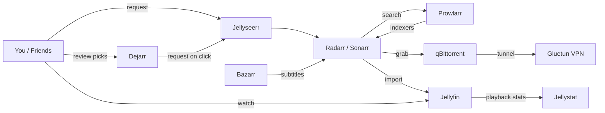

# Home Media Server

A self-hosted media server stack that lets you request, download, and stream movies and TV shows from your own hardware. Built with Docker.

## What's Included

| Service | What It Does | Port |
|---|---|---|
| **Jellyfin** | Stream your media (like a personal Netflix) | `8096` |
| **Jellyseerr** | Request movies/shows (your friends can use this too) | `5055` |
| **Radarr** | Automatically finds and downloads movies | `7878` |
| **Sonarr** | Automatically finds and downloads TV shows | `8989` |
| **Bazarr** | Automatically downloads subtitles for Radarr/Sonarr | `6767` |
| **Prowlarr** | Manages torrent indexers for Radarr/Sonarr | `9696` |
| **qBittorrent** | Downloads torrents | `8080` |
| **Gluetun** | VPN tunnel (all torrent traffic goes through this) | - |
| **FlareSolverr** | Bypasses Cloudflare protection on indexer sites | - |
| **Unpackerr** | Extracts compressed downloads automatically | - |
| **Recyclarr** | Syncs TRaSH Guides quality profiles/custom formats into Radarr/Sonarr daily | - |
| **Jellystat** | Playback analytics for Jellyfin (backed by Postgres) | `3002` |
| **Dejarr** | Weekly AI media picks with a Trakt feedback loop, auto-requests via Jellyseerr | `3003` |
| **Glance** | Dashboard to monitor everything | `3000` |
| **Watchtower** | Monitors for container image updates | - |

### How It All Connects



## Prerequisites

You'll need the following before starting:

- **A Linux machine** (Ubuntu, Debian, Arch, etc.) that will stay on 24/7
- **Docker** and **Docker Compose** installed ([install instructions](https://docs.docker.com/engine/install/))
- **A ProtonVPN account** (paid plan with WireGuard support)
- **Storage space** for your media (an external/internal hard drive works)
- **[Optional] An NVIDIA GPU** for hardware-accelerated video transcoding
- **[Optional] A [Tailscale](https://tailscale.com) account** to access your server remotely from anywhere (phone, laptop, etc.) without exposing it to the internet
- **[Optional] A domain + cheap VPS** for public access (e.g., for family members who shouldn't have to install Tailscale). See [Public Access](#public-access-optional) below.

### Getting Your ProtonVPN WireGuard Key

1. Log in to [ProtonVPN](https://account.protonvpn.com)
2. Go to **Downloads** > **WireGuard configuration**
3. Create a new WireGuard certificate/key. **Important**: enable **NAT-PMP (Port Forwarding)** when generating it — without this, qBittorrent will sit on port 0 and never seed.
4. In the generated config, the `PrivateKey` line is what you need

## Setup

### 1. Clone this repo

```bash
git clone https://github.com/SyedAbuTalib/server.git
cd server
```

### 2. Create your storage directories

Pick where you want your media stored. The default is `/mnt/storage/data`. If you want it somewhere else (like `~/media` or an external drive), just replace `/mnt/storage/data` everywhere in `docker-compose.yml`.

```bash
mkdir -p /mnt/storage/data/torrents
mkdir -p /mnt/storage/data/media/movies
mkdir -p /mnt/storage/data/media/tv
```

### 3. Configure your environment

```bash
cp .env.example .env
```

Now edit `.env` with your actual values:

```bash
nvim .env
```

Fill in:
- `WIREGUARD_PRIVATE_KEY` - from the ProtonVPN step above
- `DISCORD_TOKEN` and `DISCORD_WEBHOOK_ID` - from a Discord webhook URL (format: `discord://TOKEN@WEBHOOK_ID`). Shared by Watchtower, Unpackerr, and Dejarr for notifications. Optional; remove the notification lines from `docker-compose.yml` if you don't want Discord notifications.
- `SONARR_API_KEY` and `RADARR_API_KEY` - you'll get these AFTER first startup (see step 6)
- `SERVER_HOSTNAME` - your machine's hostname (run `hostname` to find out)
- `SERVER_URL` - `http://YOUR_HOSTNAME` (e.g., `http://myserver`)
- `JELLYSTAT_DB_USER`, `JELLYSTAT_DB_PASSWORD`, `JELLYSTAT_JWT_SECRET` - any values you pick. Generate the password/secret with `openssl rand -hex 32`. They only need to be unique per install; you'll never type them again.
- The Tailscale and weather fields are optional (only used by the Glance dashboard)

> **Dejarr** has additional required vars (`GEMINI_API_KEY`, `TRAKT_CLIENT_ID`, `TRAKT_CLIENT_SECRET`, `TRAKT_REFRESH_TOKEN`, `JELLYSEERR_API_KEY`) — see the [Dejarr](#k-dejarr-3003---weekly-ai-picks) setup section if you want to use it, or remove the `dejarr` service from `docker-compose.yml` if you don't.

### 4. [If you DON'T have an NVIDIA GPU] Remove the GPU section

If your machine doesn't have an NVIDIA GPU, you **must** edit `docker-compose.yml` and remove these lines from the `jellyfin` service (otherwise Docker will fail to start):

```yaml
    deploy:
      resources:
        reservations:
          devices:
            - driver: nvidia
              count: 1
              capabilities: [gpu]
```

If you DO have an NVIDIA GPU, make sure you have the [NVIDIA Container Toolkit](https://docs.nvidia.com/datacenter/cloud-native/container-toolkit/latest/install-guide.html) installed.

### 5. Start everything

```bash
docker compose up -d
```

Wait about 30 seconds for everything to initialize. Check that all containers are running:

```bash
docker ps
```

You should see all 16 containers with status `Up`. (If you removed `dejarr` because you didn't fill in those env vars, it'll be 15.)

### 6. Configure the services

This is the most involved part. You need to connect the services to each other through their web UIs. Open each one in your browser using `http://YOUR_SERVER_IP:PORT`.

The order below matters — earlier steps create credentials that later steps depend on. Don't skip around.

#### A. qBittorrent (`:8080`) - Download client

Set this up first so the rest of the stack has a working downloader with a known password.

1. Get the temporary admin password from the logs: `docker logs qbittorrent 2>&1 | grep password`
2. Go to `http://YOUR_IP:8080` and log in as `admin` with that temp password
3. Go to **Settings** (gear icon) > **Web UI** > **Change the default password** — pick something memorable; you'll paste it into Radarr and Sonarr next
4. Go to **Settings** > **Downloads** > set **Default Save Path** to `/data/torrents`
5. Save

#### B. Radarr (`:7878`) - Movies

1. Go to `http://YOUR_IP:7878`
2. Create a username and password when prompted
3. Go to **Settings** > **General** > copy the **API Key** somewhere (you'll need it soon)
4. Go to **Settings** > **Download Clients** > **Add** > **qBittorrent**
   - Host: `gluetun`
   - Port: `8080`
   - Username: `admin`
   - Password: the one you set in step A
5. Go to **Settings** > **Media Management** > **Add Root Folder** > `/data/media/movies`

#### C. Sonarr (`:8989`) - TV Shows

Same steps as Radarr, but:
- Root folder: `/data/media/tv`
- Copy its API key too

#### D. Update your `.env` with the API keys

Now that Radarr and Sonarr are running, paste their API keys into your `.env`:

```
SONARR_API_KEY=your_key_here
RADARR_API_KEY=your_key_here
```

Then restart the services that read those keys so they pick up the new values:

```bash
docker compose up -d unpackerr recyclarr dejarr
```

(Skip `dejarr` from that list if you removed it earlier.)

#### E. Prowlarr (`:9696`) - Indexers

Prowlarr finds torrents on indexer sites and feeds them to Radarr/Sonarr.

1. Go to `http://YOUR_IP:9696`
2. Create a username and password when prompted
3. **Indexers** > **Add Indexer** > pick a few from the list (`1337x`, `The Pirate Bay`, `RARBG`, `EZTV`, `YTS` are common public starters)
4. **Settings** > **Apps** > **Add Application**:
   - **Radarr**: Sync Level = `Full Sync`, Prowlarr Server = `http://prowlarr:9696`, Radarr Server = `http://radarr:7878`, API Key = your Radarr API key from step B
   - **Sonarr**: same idea with `http://sonarr:8989` and your Sonarr API key
5. Click **Test** on each, then **Save**

#### F. Jellyfin (`:8096`) - Media server

1. Go to `http://YOUR_IP:8096`
2. Follow the setup wizard
3. Add media libraries:
   - **Movies**: `/data/media/movies`
   - **Shows**: `/data/media/tv`
4. Create user accounts for anyone who will be watching

#### G. Jellyseerr (`:5055`) - Request portal

1. Go to `http://YOUR_IP:5055`
2. Sign in with your Jellyfin account
3. Connect to Jellyfin:
   - Host: `http://jellyfin`
   - Port: `8096`
4. Add Radarr:
   - Host: `radarr`
   - Port: `7878`
   - API Key: your Radarr API key
   - Click **Test**, then set a quality profile and root folder
5. Add Sonarr:
   - Host: `sonarr`
   - Port: `8989`
   - API Key: your Sonarr API key
   - Click **Test**, then set a quality profile and root folder

#### H. Bazarr (`:6767`) - Subtitles

1. Go to `http://YOUR_IP:6767`
2. Go to **Settings** > **Sonarr** > add Sonarr (host `sonarr`, port `8989`, your Sonarr API key)
3. Go to **Settings** > **Radarr** > add Radarr (host `radarr`, port `7878`, your Radarr API key)
4. Go to **Settings** > **Languages** and add the languages you want subtitles in
5. Go to **Settings** > **Providers** and enable a couple of subtitle providers (OpenSubtitles, Subscene, etc.)

#### I. Jellystat (`:3002`) - Playback analytics

1. Go to `http://YOUR_IP:3002` — the first visit shows a sign-up form. Create the admin user (any username/password).
2. Connect to Jellyfin: paste the Jellyfin URL (`http://jellyfin:8096`) and a Jellyfin API key. To create the key, go to Jellyfin > **Dashboard** > **API Keys** > **+**.
3. Trigger an initial sync from the **Sync** tab in Jellystat.

#### J. Recyclarr - Quality profiles (no UI)

Recyclarr runs on a daily cron and syncs [TRaSH Guides](https://trash-guides.info/) custom formats and quality profiles into Radarr/Sonarr. There's no web UI.

1. Drop a `recyclarr.yml` config into `./docker/recyclarr/` (start from [the wiki examples](https://recyclarr.dev/wiki/yaml/config-examples/))
2. Run it once manually to apply: `docker compose run --rm recyclarr sync`

#### K. Dejarr (`:3003`) - Weekly AI picks

Dejarr asks Gemini for 10 shows + 10 movies a week based on your Trakt history and your existing library, then lets you mark "seen / not interested / add to library" from a small web UI. Adds go through Jellyseerr.

You need three API integrations. Get them in this order:

**1. Gemini API key**
- Go to [aistudio.google.com/apikey](https://aistudio.google.com/apikey) > **Create API key**.
- Paste it into `.env` as `GEMINI_API_KEY`.

**2. Jellyseerr API key**
- In Jellyseerr: **Settings** > **General** > copy **API Key**.
- Paste it into `.env` as `JELLYSEERR_API_KEY`.

**3. Trakt OAuth** (the most fiddly — follow exactly)
- Sign up at [trakt.tv](https://trakt.tv) if you don't already have an account.
- Go to [trakt.tv/oauth/applications](https://trakt.tv/oauth/applications) and create a new app:
  - **Name**: anything (e.g. "Dejarr")
  - **Redirect URI**: `urn:ietf:wg:oauth:2.0:oob`
  - Leave Javascript origins blank
- Copy the **Client ID** and **Client Secret** into `.env` as `TRAKT_CLIENT_ID` and `TRAKT_CLIENT_SECRET`.
- Now you need a one-time `TRAKT_REFRESH_TOKEN`. In your browser, open this URL (replace `YOUR_CLIENT_ID` with your actual Client ID):
  ```
  https://trakt.tv/oauth/authorize?response_type=code&client_id=YOUR_CLIENT_ID&redirect_uri=urn:ietf:wg:oauth:2.0:oob
  ```
- Approve. Trakt shows you a code on the next page — copy it.
- In a terminal, run (substituting the three values):
  ```bash
  CODE="paste-the-code-here"
  CLIENT_ID="your-client-id"
  CLIENT_SECRET="your-client-secret"
  curl -sX POST https://api.trakt.tv/oauth/token \
    -H "Content-Type: application/json" \
    -d "{\"code\":\"$CODE\",\"client_id\":\"$CLIENT_ID\",\"client_secret\":\"$CLIENT_SECRET\",\"redirect_uri\":\"urn:ietf:wg:oauth:2.0:oob\",\"grant_type\":\"authorization_code\"}"
  ```
- The response is JSON containing a `refresh_token` field — copy that value into `.env` as `TRAKT_REFRESH_TOKEN`.

**4. Start Dejarr**

```bash
docker compose up -d dejarr
```

Open `http://YOUR_IP:3003`. It runs automatically every Friday at 18:00 (configurable via `SCHEDULE_DAY` / `SCHEDULE_HOUR` env vars on the dejarr service). The "Run a new batch" button triggers one on demand.

### 7. Test it

1. Open Jellyseerr (`:5055`)
2. Search for a movie
3. Click **Request**
4. Watch it flow: Jellyseerr > Radarr > qBittorrent > Jellyfin
5. Once downloaded, it should appear in Jellyfin within a few minutes

## Public Access (Optional)

By default the stack is reachable only on your LAN (or via Tailscale). If you want non-technical users — say, family — to use Jellyfin and Jellyseerr by just typing a URL, the setup is:

```
Internet ──> your domain ──> small VPS (Caddy reverse proxy) ──> WireGuard tunnel ──> your home server
```

The VPS only terminates TLS and forwards bytes — your home machine still does all the decoding/transcoding. Your home IP is never exposed.

### Why not Tailscale Funnel or Cloudflare Tunnel?

- **Tailscale Funnel**: not designed for high-bandwidth video — would throttle multiple concurrent streams.
- **Cloudflare Tunnel**: free tier TOS discourages video streaming through their proxy.
- **VPS + WireGuard + Caddy**: no bandwidth caps beyond what you pay for, full control. A $5/mo Hetzner CPX11 with 20 TB/month included egress handles several concurrent 4K streams comfortably.

### What you need

- A domain (e.g. [Porkbun](https://porkbun.com), [Cloudflare Registrar](https://www.cloudflare.com/products/registrar/) — ~$10/yr)
- A small VPS (Hetzner CPX11 or any cheap Linux box with public IP)
- Open UDP `51820` outbound on your home network (most routers do by default)

### Setup

1. **Point DNS** at your VPS. At your registrar add two A records — `@` (apex) and `request` — both pointing to your VPS's public IP.

2. **Generate the home WireGuard key** (on your home server):

   ```bash
   sudo ./scripts/setup-home-wg.sh
   ```

   It prints a public key — copy it.

3. **Bootstrap the VPS** (on a fresh Ubuntu VPS, SSH in as root):

   ```bash
   scp scripts/setup-vps.sh root@<vps-ip>:/root/
   ssh root@<vps-ip>
   sudo HOME_WG_PUBKEY="<key-from-step-2>" DOMAIN="yourdomain.com" /root/setup-vps.sh
   ```

   At the end it prints the VPS public key and IP.

4. **Finish the home side** (on your home server):

   ```bash
   sudo VPS_IP="<vps-ip>" VPS_WG_PUBKEY="<key-from-step-3>" ./scripts/setup-home-wg.sh
   ```

5. **Test**: `https://yourdomain.com` should load Jellyfin, `https://request.yourdomain.com` should load Jellyseerr. Let's Encrypt certs are issued automatically.

6. **(Recommended) Jellyfin reverse-proxy setting**: in Jellyfin → **Dashboard → Networking → Known proxies**, add `10.10.10.1` so user activity logs show real client IPs instead of the tunnel.

### Backups

Keep a copy of `/etc/wireguard/` (both ends) and `/etc/caddy/Caddyfile` (VPS) somewhere safe — restoring takes 5 minutes with them, much longer without:

```bash
sudo tar czf ~/server-backups/home-wg-$(date +%Y%m%d).tar.gz /etc/wireguard
ssh root@<vps-ip> 'tar czf - /etc/wireguard /etc/caddy/Caddyfile' \
    > ~/server-backups/vps-$(date +%Y%m%d).tar.gz
```

## Day-to-Day Usage

- **To request a movie/show**: use Jellyseerr (`:5055`)
- **To watch**: use Jellyfin (`:8096`) or the Jellyfin app on your phone/TV
- **To check on downloads**: use qBittorrent (`:8080`)
- **To see your dashboard**: use Glance (`:3000`)
- **To see playback stats**: use Jellystat (`:3002`)
- **To get weekly AI picks**: use Dejarr (`:3003`)

## Common Commands

```bash
# Start everything
docker compose up -d

# Stop everything
docker compose down

# Restart a specific service
docker compose restart jellyfin

# Force recreate everything (if something is acting weird)
docker compose up -d --force-recreate

# View logs for a service
docker logs jellyfin --tail 50

# Check what's running
docker ps

# Update all container images
docker compose pull && docker compose up -d
```

## Troubleshooting

**"Container exits immediately"**
- Check logs: `docker logs CONTAINER_NAME`
- Most common cause: bad config or missing directories

**"qBittorrent can't download anything"**
- The VPN might be down. Check: `docker logs gluetun`
- Verify your WireGuard key is correct in `.env`

**"qBittorrent connects but everything stays at 0 KB/s"**
- ProtonVPN port forwarding isn't active. Re-generate the WireGuard config with **NAT-PMP** enabled (see the WireGuard key section) and update `WIREGUARD_PRIVATE_KEY` in `.env`.

**"Downloads finish but don't show up in Jellyfin"**
- Make sure root folders are set correctly in Radarr/Sonarr (`/data/media/movies` and `/data/media/tv`)
- Check that Jellyfin's library scan is running (Dashboard > Scheduled Tasks)

**"Jellyfin is buffering/slow"**
- Without a GPU, Jellyfin has to use CPU for transcoding. Try setting playback quality to "Original" in the player to avoid transcoding entirely.

**"Glance dashboard shows all services as errors"**
- Make sure `SERVER_HOSTNAME` and `SERVER_URL` in `.env` match your machine's hostname

**"I don't have an NVIDIA GPU and Docker won't start"**
- Remove the `deploy:` section from the `jellyfin` service in `docker-compose.yml` (see step 4)

**"Dejarr container keeps restarting"**
- Check `docker logs dejarr` — it almost always means one of the five Dejarr env vars is missing or wrong. Re-check `GEMINI_API_KEY`, `JELLYSEERR_API_KEY`, `TRAKT_CLIENT_ID`, `TRAKT_CLIENT_SECRET`, `TRAKT_REFRESH_TOKEN` in `.env`, then `docker compose up -d dejarr`.
